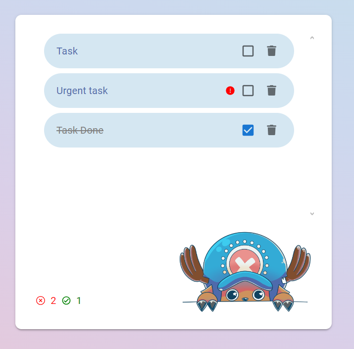
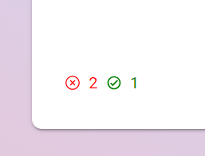

# **ADA TASKS**

## ABOUT

The main goal of this project is to make a ToDo app where the user can create tasks to do and visualize them depending on what the user needs, using react as a library for develop the code and a css framework for react.

 
    

## Skills used

 
    

## WEBSITE STRUCTURE / HOW TO USE IT

### ✦ Forms Container

In this section I designed the forms structures. We can se 2 forms with inputs inside: the submit form and the show form.

-   SubmitForm
    The first one is to be able to add any task that the user needs to do. He/she has to write on the input text between 4 and 15 characters, otherwise it wont be able to submit. Also he can add the urgent/not urgent category with the select besides the input text, for default it will always be "not urgent" so if he doesn't touch it, it will submit the task with that category.
    All the tasks will be saved on the localstorage of the application that is using to open the app.

 
    

-   ShowForm
    This form is just only to filter the tasks, so it will be easier for the user to see tasks depending on what he needs. For default both selects will be always on "All", so if the user needs to see certain tasks (like done tasks) he'll need to change bi clicking on the options inside the select. You can stack the filters.

 
    

### ✦ Tasks Container

At this section we'll visualize the tasks that the user updated, with filters or all the tasks.

 
    

On every task the user will be able to see a red mark if the task was marked at urgent, besides that there is a checkbox that if the user marks it, it will sho the task as complete. Also it has a trash icon that if the user press it will delete the task from the local storage.

 
   

On the left/down corner the user will be able to see by icons how many tasks are complete and how many are not.

 
   

## NEW KNOWLEDGE APPLIED

### ✦ React

In this case, as is a project for the FrontEnd career of ADA ITW, I aplied all the past knowledge from the other projects and the new one that is how to use react to build an application with a css framework for react. In my case I used Materiual UI.

## RESOURCES

-   CSS Framework -> [Material UI](https://mui.com/material-ui/)
-   Illustrations -> [Myself <3](https://www.instagram.com/renga.art/)

## CONTACT ME

If you are interested in contacting me, as I say it on the project, you can find me on the following links:

-   [LinkedIn](https://www.linkedin.com/in/romina-rao-50a61a1ba/)
-   [raoromina96@gmail.com](mailto:raoromina96@gmail.com)
-   [Instagram](https://instagram.com/renga.art/)
-   [Check my other GitHub repositories](https://github.com/RomiRao?tab=repositories)
